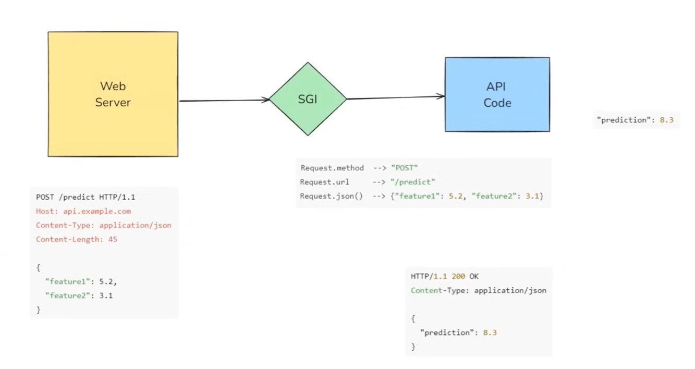
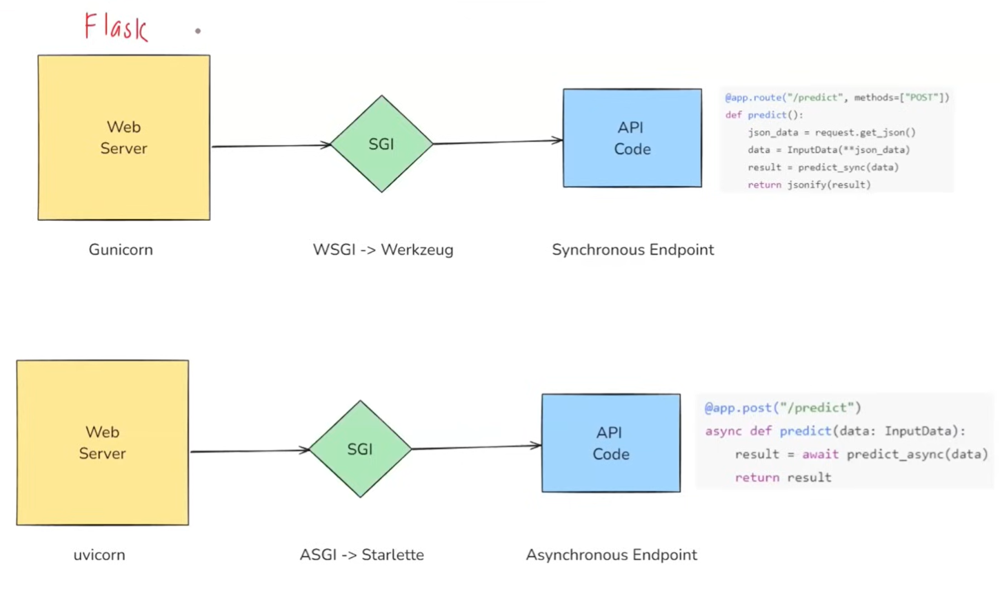

# 📘 FastAPI YouTube Playlist Summary

## 🎯 Introduction to FastAPI

- FastAPI is a modern, high-performance Python framework for building APIs.
- Ideal for data science, AI, and ML practitioners due to its speed, ease of use, and support for modern Python features.
- Built on top of **Starlette** (for HTTP) and **Pydantic** (for data validation).

---

## 🚀 Why FastAPI?

- **Fast to run**: Handles concurrent users efficiently (asynchronous support).
- **Fast to code**: Minimal boilerplate, auto-validation, and documentation.

---

## 🧱 Underlying Components

- **Starlette**: Manages HTTP requests and responses.
- **Pydantic**: Ensures strict type-checking and validation of request data.

---

## 🌐 API Request Flow (With ASGI)

1. Client sends HTTP request.
2. Web server (Uvicorn) receives it.
3. ASGI protocol translates request for Python.
4. FastAPI processes the logic and returns a response.



---

## 🆚 FastAPI vs Flask

| Feature     | Flask (WSGI)             | FastAPI (ASGI)          |
| ----------- | ------------------------ | ----------------------- |
| Protocol    | WSGI (Synchronous)       | ASGI (Asynchronous)     |
| Web Server  | Gunicorn                 | Uvicorn                 |
| Concurrency | Blocking (one at a time) | Non-blocking (parallel) |
| Middleware  | Werkzeug                 | Starlette               |



**Conclusion**: FastAPI is more scalable and better suited for modern, async web apps.

---

## 🍽️ Analogy: Waiter in Restaurant

- **Flask**: Waiter handles one customer at a time.
- **FastAPI**: Waiter can take multiple orders and serve them as they are ready (non-blocking).

---

## 💡 Async/Await in FastAPI

- Enables handling of multiple requests concurrently.
- Useful in I/O-bound tasks like ML model predictions, DB operations, etc.

---

## ⚡ FastAPI Features

1. **Automatic Input Validation**: via Pydantic and type hints.
2. **Interactive Docs**: Swagger UI (`/docs`) and ReDoc (`/redoc`).
3. **Seamless Integration**: Works well with:
   - ML libraries: scikit-learn, TensorFlow, PyTorch
   - Databases: SQLAlchemy
   - Deployment tools: Docker, Kubernetes

---

## 🛠️ FastAPI Setup & Example

1. Create and activate virtual environment:
   ```bash
   python -m venv myenv
   source myenv/bin/activate  # or .\myenv\Scripts\activate on Windows
   ```
2. Install packages:

   ```bash
   pip install fastapi uvicorn
   ```

3. Create main.py:

   ```
   from fastapi import FastAPI

   app = FastAPI()

   @app.get("/")
   def read_root():
       return {"message": "Hello World"}

   @app.get("/about")
   def about():
       return {"info": "CampusX - Learn AI"}
   ```

4. Run server:

   ```
   uvicorn main:app --reload
   ```

5. 🧪 Interactive Documentation

   - Visit http://127.0.0.1:8000/docs for Swagger UI.

   - View, test, and execute APIs with detailed request/response info.

   - Eliminates need for Postman or curl.

### ✅ Summary

FastAPI offers performance and developer productivity.

Better than Flask for concurrent, async web applications.

Auto-generated docs and validation make it ideal for modern development.
